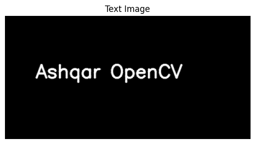
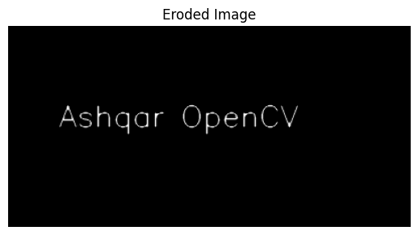
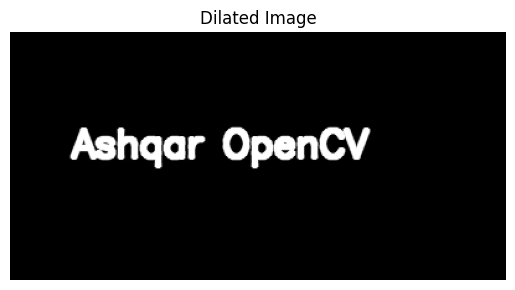

# Implementation-of-Erosion-and-Dilation
## Aim
To implement Erosion and Dilation using Python and OpenCV.

## Software Required
1. Anaconda - Python 3.7
2. OpenCV

## Algorithm:
### Step1:
Import all the necessary modules for the program

### Step2:
Create an image using cv2.putText()


### Step3:
Create the structuring element using cv2.getStructuringElement()

### Step4:
Generate the eroded image using cv2.erode()

### Step5:
Generate the dilated image using cv2.dilute()

---

## Program:

### Developed by: Ashqar Ahamed S T
### Register Number: 212224240018

``` Python
# Import the necessary packages

import cv2
import numpy as np
from matplotlib import pyplot as plt
```

``` python
# Create the Text using cv2.putText
img = np.zeros((200, 400), dtype=np.uint8)
font = cv2.FONT_HERSHEY_SIMPLEX
cv2.putText(img, 'Ashqar OpenCV', (50, 100), font, 1, (255), 2, cv2.LINE_AA)

plt.imshow(img, cmap='gray')
plt.title('Text Image')
plt.axis('off')
```

```python
# Create the structuring element
kernel = np.ones((5, 5), dtype=np.uint8)

```

```python
# Erode the image
kernel1 = cv2.getStructuringElement(cv2.MORPH_RECT, (3, 3))
eroded = cv2.erode(img, kernel1)

plt.imshow(eroded, cmap='gray')
plt.title('Eroded Image')
plt.axis('off')


```


```python
# Dilate the image
dilated = cv2.dilate(img, kernel1)

plt.imshow(dilated, cmap='gray')
plt.title('Dilated Image')
plt.axis('off')


```
---

## Output:

### Display the input Image
<br>



### Display the Eroded Image
<br>



### Display the Dilated Image
<br>



## Result
Thus the generated text image is eroded and dilated using python and OpenCV.
